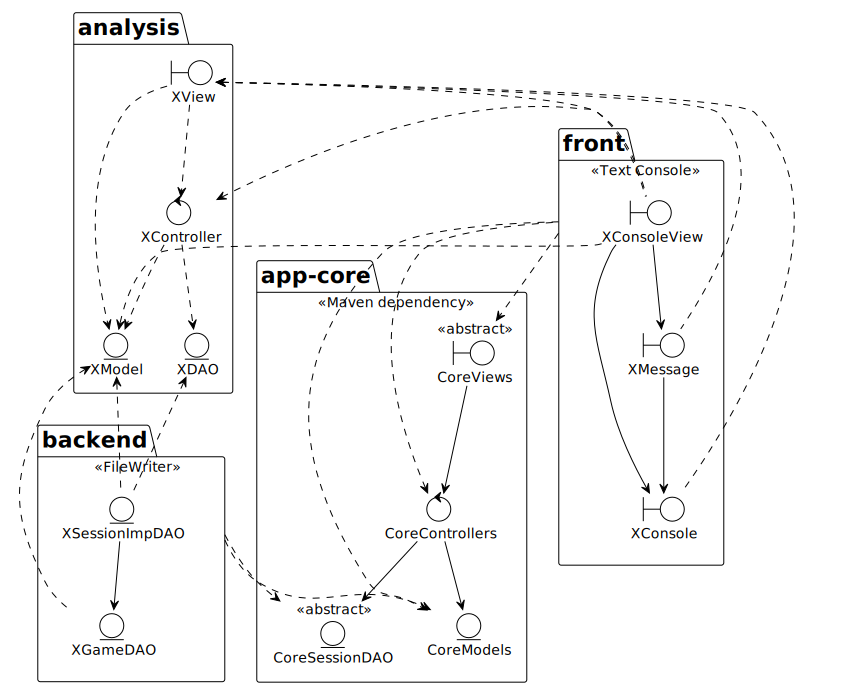
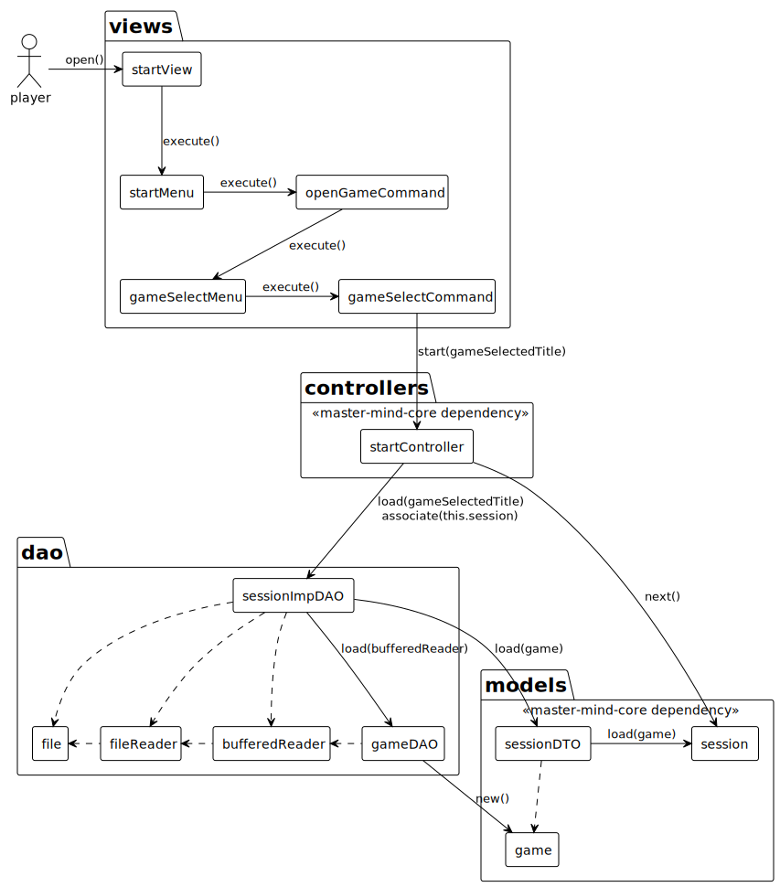
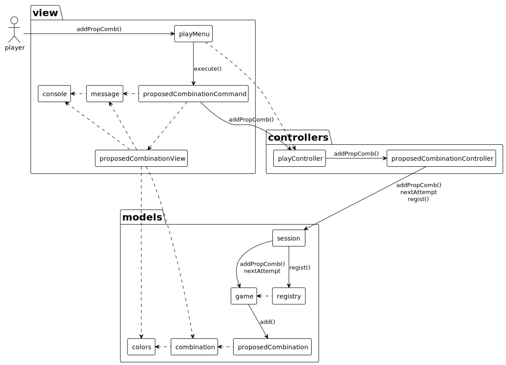

# Master Mind Console
### Index
- **[Description](#description)**
- **[Documentation](#documentation)**
  - **[Application core](#application-core)**
  - **[Architecture Design](#architecture-design)**
  - **[Colaboration Diagram 'Open Case'](#colaboration-diagram-open-case)**
  - **[ProposeCombination Case](#colaboration-diagram-proposecombination-case)**
- **[User Interface](#user-interface)**

## Description

This console application implements the views to display a text-based dashboard that shows the messages with the
information extracted from the core component, thus the implementation It is only responsible for printing messages and
validating user input data. To implement the persistence it uses FileWriter to save game data as plain text.

## Documentation

### Application core

The application core is developed in Java and is implemented as a maven dependency.

**[Here you can check the core application documentation](https://github.com/PacoMorando/multiplatform-master-mind#documentation)**


### Architecture Design


### Colaboration Diagram 'Open Case'


### Colaboration Diagram 'ProposeCombination Case'


## User Interface

```
--- MASTER MIND --- 
----- Choose one option -----
1) New Game
2) Open a saved game
   1
   Attempt: 0
****
----- Choose one option -----
1) Propose combination
2) Exit
   1
   Propose a combination:
   ggrr
   Attempt: 1
****
ggrr <--- 0 Blacks, 0 Whites
----- Choose one option -----
1) Propose combination
2) Undo
3) Exit
   1
   Propose a combination:
   mmbb
   Attempt: 2
****
ggrr <--- 0 Blacks, 0 Whites
mmbb <--- 1 Blacks, 2 Whites
----- Choose one option -----
1) Propose combination
2) Undo
3) Exit
   1
   Propose a combination:
   yycc
   Attempt: 3
****
ggrr <--- 0 Blacks, 0 Whites
mmbb <--- 1 Blacks, 2 Whites
yycc <--- 0 Blacks, 0 Whites
----- Choose one option -----
1) Propose combination
2) Undo
3) Exit
   1
   Propose a combination:
   bbbm
   You've won!!! ;-)
   Do you want to save?? (y/n):
   n
   Do you want to continue ? (y/n):
   y
   --- MASTER MIND ---
   ----- Choose one option -----
1) New Game
2) Open a saved game
```